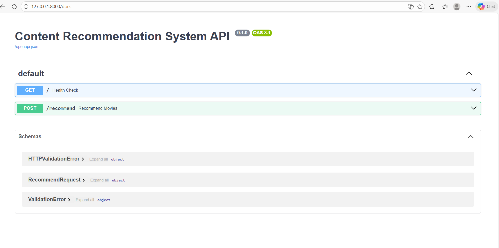
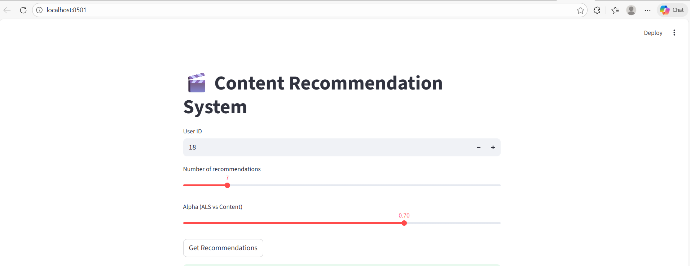
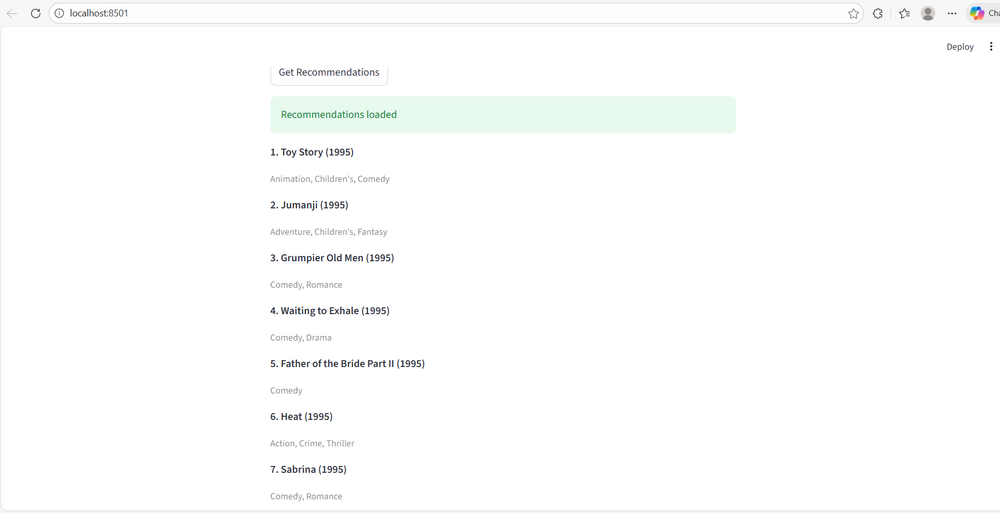

# Content Recommendation System

An end-to-end **Content Recommendation System** built using collaborative filtering, content-based filtering, and a hybrid approach.  
The project includes **model training, evaluation, an API backend, and a Streamlit frontend**.

---
## Demo

### FastAPI Backend (Swagger UI)

REST API exposing the hybrid recommendation model with health check and recommendation endpoint.

### Streamlit Interface – Inputs

Interactive UI to control user ID, number of recommendations, and hybrid weight (ALS vs content).

### Streamlit Interface – Recommendations

Top-N personalized recommendations generated in real time using the hybrid model.


## 🚀 Features

- Collaborative Filtering using **ALS (Implicit Feedback)**
- Content-Based Filtering using **Item Similarity**
- Hybrid Recommendation (ALS + Content)
- Offline evaluation (Recall@K, MAP@K)
- REST API built with **FastAPI**
- Interactive UI built with **Streamlit**
- Modular, production-style project structure

---

## 🧠 Tech Stack

- Python
- Pandas, NumPy
- Implicit (ALS)
- Scikit-learn
- FastAPI
- Streamlit
- Git & GitHub

- ## 📦 Dataset

- MovieLens (implicit feedback derived from ratings)


---

## 📂 Project Structure

content_recommendation_system/
│
├── data/
│ ├── raw/
│ └── processed/
│
├── notebooks/
│ ├── 01_data_understanding.ipynb
│ ├── 02_feature_engineering.ipynb
│ ├── 03_modeling_baseline_cf.ipynb
│ ├── 04_modeling_als_implicit_cf.ipynb
│ ├── 05_als_hyperparameter_tuning.ipynb
│ ├── 06_hybrid_modeling.ipynb
│ └── 07_test_recommender.ipynb
│
├── models/
│ ├── als_implicit_model.pkl
│ ├── item_similarity.pkl
│ └── encoders/
│
├── src/
│ └── recommender.py
│
├── app/
│ └── api.py
│
├── streamlit_app/
│ └── app.py
│
├── requirements.txt
└── README.md


---

## 🔧 How to Run

### 1️⃣ Install dependencies
```bash
pip install -r requirements.txt

2️⃣ Start FastAPI backend
uvicorn app.api:app --reload

API docs available at:
http://127.0.0.1:8000/docs

3️⃣ Start Streamlit frontend
streamlit run streamlit_app/app.py


## 🧠 Recommendation Logic

A hybrid recommender combines ALS-based collaborative filtering
with item-similarity-based content filtering using a tunable
weighting parameter to balance personalization and discovery.


## 🧩 Key Learnings

- Handling implicit feedback differs significantly from explicit ratings
- ALS performs well at scale but struggles with cold-start users
- Hybrid models outperform single-strategy recommenders
- Offline metrics do not always reflect real user satisfaction


✅ Outcome

This project demonstrates:

End-to-end ML workflow

Recommendation system fundamentals

Model evaluation

API deployment

Frontend integration


📌 Future Improvements

Cold-start handling

Online feedback loop

Deployment on cloud (Docker / AWS / GCP)

User authentication


